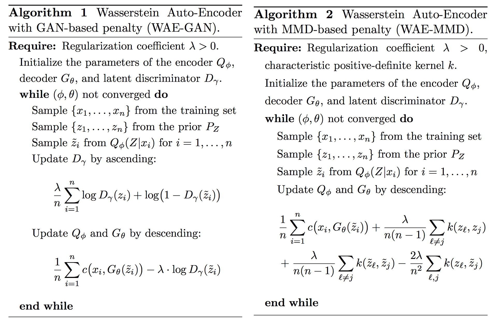

# Wasserstein Autoencoders

As part of the implementation series of [Joseph Lim's group at USC](http://csail.mit.edu/~lim), our motivation is to accelerate (or sometimes delay) research in the AI community by promoting open-source projects. To this end, we implement state-of-the-art research papers, and publicly share them with concise reports. Please visit our [group github site](https://github.com/gitlimlab) for other projects.

This project is implemented by [Te-Lin Wu](https://github.com/telin0411) and the codes have been reviewed by []() before being published.

## Descriptions
This project is a [PyTorch](http://pytorch.org) implementation of [Wasserstein Autoencoders](https://arxiv.org/pdf/1711.01558.pdf) which was published as a conference proceeding at ICLR 2018 as an Oral. The main idea of this paper is to minimize a penalized form of Wasserstein distance between model induced latent distribution and the target distribution. This is different from standard VAE training where WAE encourages the latent distribution to match the prior. This paper propose two penalties, a GAN-based penalty and a Maximum Mean Discrepancy (MMD) based penalty to push the two distributions closer. Differ from normal GAN-based autoencoder (AAE), WAE-GAN perform the adversarial training directly on the latent space, which can deal with possibly multi-modal prior. For the MMD-based, two kernels, which are RBF and IMQ, are used for the positive-definite reproducing kernel measuring the distributional divergence. Priors in this work can be assumed to be drawn from Gaussian distribution. (Details please refer to the original paper.)

The below is an illustration of the main concept for the proposed training.

Both VAE and WAE minimize the reconstruction loss and the penalties to regularize discrepancy between P and distribution induced by encoder Q. For VAE forces every latent points to match P depicted as the white shape in the figure, which can be seen intersecting with one another, resulting in suboptimal reconstruction. In contrast, WAE forces a continuous mixture to match P, and thus the latent points can get away from intersecting one another, resulting in better reconstruction results. 

The two proposed algorithms are as shown below:


Results generated from random sampled noise vector (GAN):

Results generated from random sampled noise vector (MMD):

* The implemented model can be trained on dataset [CelebA](http://mmlab.ie.cuhk.edu.hk/projects/CelebA.html).
* Note that this implementation may differ in details from the original paper such as model architectures, hyperparameters, applied optimizer, etc. while maintaining the main proposed idea.
* This code is still being developed and subject to change.

## Prerequisites

- Python 3.5
- [PyTorch](http://pytorch.org)
- [TorchVision](http://pytorch.org)
- [SciPy](http://www.scipy.org/install.html)
- [NumPy](http://www.numpy.org/)

## Usage
Run the following command for details of each arguments.
```bash
$ python3 main.py -h
```

### Downloading the datasets
* Run the following command to download the celebA dataset, note that it will automatically store to ./data/
* Code thanks to [carpedm20](https://github.com/carpedm20/DCGAN-tensorflow)
```bash
$ python download.py celebA
```

### Train the models
* Below is the example training commands, the code will automatically generate images for testing during training to the --outf directory.
* You can also refer to run.sh for reproducing the results.
* In this examle, you need to create a directory named data/CelebA, and store the extracted directory of celebA dataset there.
* Notice that since the dataloader utilizes image folder API, so the dataroot should look like /path/to/dataroot/folder/XXX.jpg
* In this example the /path/to/dataroot/ is data/CelebA and you can name the folder whatever name you like.
```bash
$ python3 main.py --dataroot=data/CelebA --dataset='celebA' --gpu_id=1 --cuda --noise='add_noise' --outf=gan_outputs/ --mode='gan'
```

## Author

Te-Lin Wu / [@telin0411](https://github.com/telin0411) @ [Joseph Lim's research lab](https://github.com/gitlimlab) @ USC
