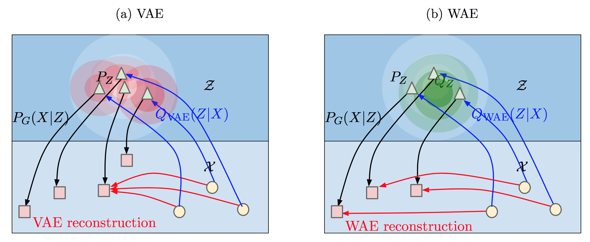

# Wasserstein Autoencoders

As part of the implementation series of [Joseph Lim's group at USC](http://csail.mit.edu/~lim), our motivation is to accelerate (or sometimes delay) research in the AI community by promoting open-source projects. To this end, we implement state-of-the-art research papers, and publicly share them with concise reports. Please visit our [group github site](https://github.com/gitlimlab) for other projects.

This project is implemented by [Te-Lin Wu](https://github.com/telin0411) and the codes have been reviewed by [Youngwoon Lee](https://github.com/youngwoon) before being published.

## Descriptions
This project is a [PyTorch](http://pytorch.org) implementation of [Wasserstein Auto-Encoders (WAE)](https://arxiv.org/pdf/1711.01558.pdf) which was published as a conference proceeding at ICLR 2018 as an Oral.

Representation learning has been driven by both supervised and unsupervised approaches, where variational auto-encoder (VAE) is a well-known unsupervised approach. However, it is known that VAEs tend to generate blurry results, while generative adversarial networks (GANs) can generate more visually appealing results. GANs, though gave impressive generation results, suffer from mode collapse where it sometimes cannot capture all the variability of the data distribution. Combining the advantages of both VAEs and GANs, the main idea of Wasserstein auto-encoder (WAE) is to minimize a penalized form of Wasserstein distance between the model-induced latent distribution and the target distribution. This is different from standard VAE training where WAE encourages the latent distribution to match the prior. This paper proposes two penalties, a GAN-based penalty and a Maximum Mean Discrepancy (MMD) based penalty, to push the two distributions closer.

Differ from general GAN-based adversarial auto-encoders (AAEs), WAE with the GAN-based penalty (WAE-GAN) performs the adversarial training directly on the latent space, which can deal with multi-modal prior. For the MMD-based penalty, two kernels, RBF and IMQ, are used for the positive-definite reproducing kernel measuring the distributional divergence. Priors in this work can be assumed to be modeled by Gaussian distribution. Please refer to the original paper for details.



Traditional VAEs minimize a variational lower bound which consists of a reconstruction loss and a regularizer loss, where the regularizer computes how different the original images feeding into the encoder are according to the prior *P*. However, this does not guarantee that the overall encoded latent distribution matches the prior *P*. On the other hand, VAEs require non-deterministic Gaussian encoders and random decoders during training. WAEs in contrast allow both probabilistic and deterministic encoder-decoder pairs of any kind.

As shown above, both VAE and WAE minimize the reconstruction loss and the penalties to regularize discrepancy between *P* and distribution induced by encoder *Q*. VAE forces every latent point to match *P* depicted as the white shape (light blue co-centered circles) in the figure, which can be intersecting with one another, resulting in suboptimal reconstruction. In contrast, WAE forces a continuous mixture to match *P*, and thus the latent points can get away from intersecting one another, resulting in better reconstruction results.

## Image Generation Results

The results as shown below are generated from randomly sampled noise vectors.
If carefully inspected, one can notice that WAE-GAN tends to generate more realistic results.
However, WAE-GAN is harder to train due to its adversarial nature, where WAE-MMD is more stable and vanilla VAE-like.

|                   WAE-GAN                  |                   WAE-MMD                  |
| :----------------------------------------: | :----------------------------------------: |
|  |  |


## Notes

* The implemented model can be trained on dataset [CelebA](http://mmlab.ie.cuhk.edu.hk/projects/CelebA.html).
* Note that this implementation may differ in details from the original paper such as model architectures, hyperparameters, applied optimizer, etc. while maintaining the main proposed idea.
* This code is still being developed and subject to change.

## Prerequisites

- Python 3.5
- [PyTorch](http://pytorch.org)
- [TorchVision](http://pytorch.org)
- [NumPy](http://www.numpy.org/)
- requests
- tqdm

## Usage
Run the following command for details of each arguments.
```bash
$ python3 main.py -h
```

### Download the dataset
* Run the following command to download the celebA dataset. Note that it will automatically store the dataset to `./data/`.
* Code thanks to [carpedm20](https://github.com/carpedm20/DCGAN-tensorflow)
```bash
$ python3 download_datasets.py celebA
```

### Train the models
* Below is the example training command, the code will automatically generate and store images for testing during training to the `--outf` directory.
* You can also refer to `run.sh` for reproducing the results.
* Note that since the dataloader utilizes image folder API, the `dataroot` should look like `/path/to/dataroot/sub_directory/XXX.jpg`. In this example the `/path/to/dataroot/` is `data/celebA`.
```bash
python3 main.py --dataroot=data/celebA --dataset='celebA' --gpu_id=0 --cuda --noise='add_noise' --outf=gan_outputs/ --mode='gan' --lr=0.0003 --pz_scale=1 --LAMBDA=10 --niter=55 --e_pretrain
```

## References
* [Wasserstein Auto-Encoders (WAE)](https://arxiv.org/pdf/1711.01558.pdf)
* [carpedm20's DCGAN implementation](https://github.com/carpedm20/DCGAN-tensorflow)

## Author

Te-Lin Wu / [@telin0411](https://github.com/telin0411) @ [Joseph Lim's research lab](https://github.com/gitlimlab) @ USC
